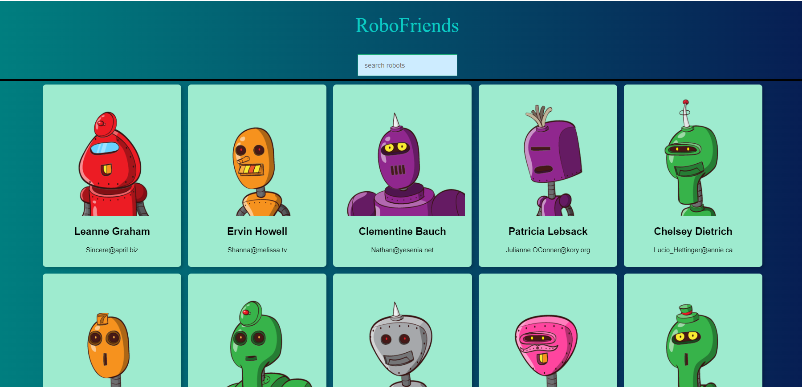
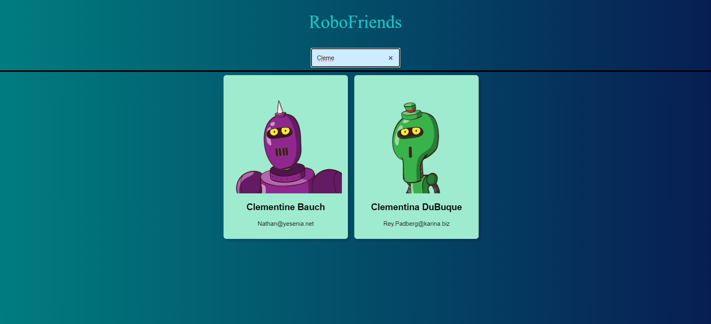

  <h2 align="center">RoboFriends</h2>

<!-- ABOUT THE PROJECT -->
## About The Project

It is a react-based web application that allows users to search for robot friends by their names. It leverages the JSONPlaceholder API's to fetch data, including names and emails, which are dynamically displayed as robot profiles. Users can enter a search query to filter and find specific robot friends quickly. 

### Screenshots

